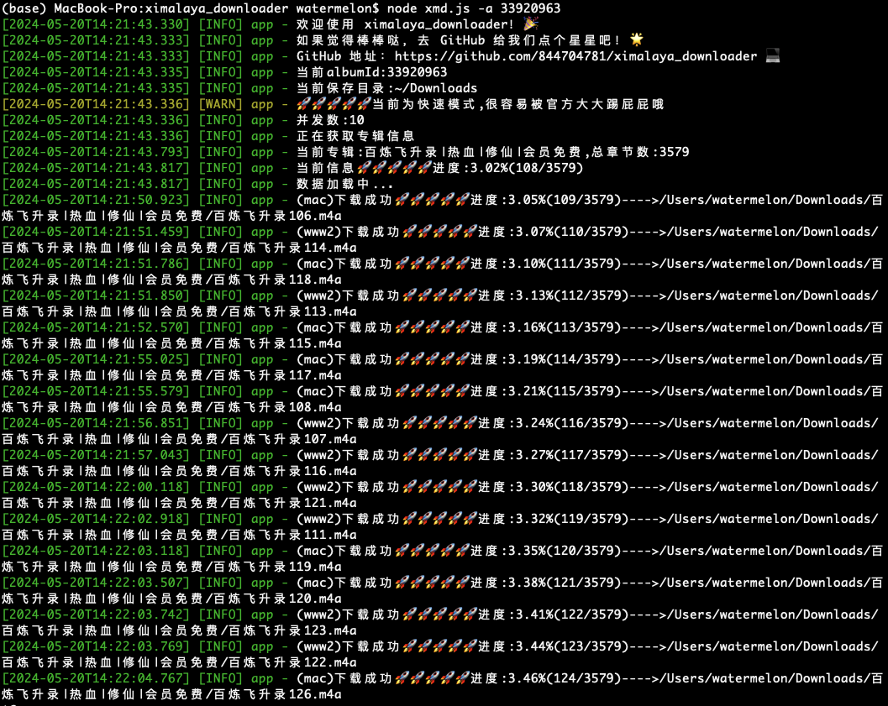

<h1 align="center">喜马拉雅下载工具</h1>
<h4 align="center">ximalaya-downloader</h4>

  


### 说明
我是这款软件的开发者，它是专为喜马拉雅音频下载而设计的，采用纯 Node.js 语言打造，仅供学习参考使用。

这个软件源自我对喜马拉雅音频的喜爱和对技术的热情。当我的喜马拉雅 VIP 账号要到期时，我发现自己还有许多喜欢的专辑没来得及听完。因此，我开发了这款软件，在 VIP 还有效的时候，将喜欢的音频专辑下载下来，以备后续慢慢享用。

软件充分利用了ES6的规范，所有解密方法都经过了我反复的研究和编写，以确保高效和稳定。尽管官方更新可能会导致部分功能失效，但在此之前，我会尽力确保软件的可靠性。

我会持续改进和更新这个项目，如果你在使用过程中遇到任何问题，请在 GitHub 上提出，我会尽力解决。如果你觉得这个项目不错，请给我点亮一个 star，将是对我最好的鼓励！

截止2024年5月22日，经测试，由于官方限制，一般一个账号一个小时可下400个视频，**每个整点被风控的账号会被重置，即可重新下载**

### 已知问题及解决办法

1. **系统繁忙，请稍后再试**

   经过测试，官方封控规则为一个账号一个小时下400个音频

   出现这种情况，代表账号被风控啦 ，可以下个整点再来试试哦

2. **今天操作太频繁啦，可以明天再试试哦~**

   出现这种情况，代表web接口的额度已经用完啦，没关系，咱们还有pc渠道可用


### 命令行版



### 已实现功能

- [x] 官方扫码登录模式
- [x] 手动配置cookie模式
- [x] 自定义下载路径
- [x] 已购声音或vip免费声音下载
- [x] 自动重新下载下载失败的音频
- [x] 自动下载最优质音频
- [x] 整个专辑全量下载
- [x] 支持喜马拉雅web端，pc端协同下载

### 源码编译

环境:
> node v20.13.1 (npm v10.5.2)

#### 普通编译

```shell
npm install 
node xmd.js --help
```

#### 命令行相关参数

```shell
node xmd.js --help
Usage: xmd [options]

Options:
  -a, --albumId <value>       albumId,必填
  -n, --concurrency <number>  并发数,默认10
  -s, --slow                  慢速模式
  -t, --type                  登录类型,可选值pc、web,默认都登陆(需要扫码多次)
  -o, --output <value>        当前要保存的目录,默认为~/Downloads (default: "~/Downloads")
  -h, --help                  display help for command
```
#### 配置文件相关参数介绍
config.json
```json
{
  "baseUrl": "https://www.ximalaya.com", //主要参数，不能修改
  "loginBaseUrl": "https://passport.ximalaya.com",//主要参数，不能修改
  "archives": "~/Downloads",//默认文件下载路径，可自行配置
  "xmd": "~/.xmd",//缓存文件保存路径，不建议修改
  "cookie": {
    "www2": {
      //www2模式就是web模式
      "serverMode": false,//开启这个模式需要在下方value位置手动配置cookie，否则会调用操作系统图片程序扫码登录
      "value": "_xmLog=h5&6fe19548-77ea-4081-ac15-79c76f9b128e&process.env.sdkVersion; wfp=ACM5MGVkODA5Y2JmODBmOTMwCIX-UWWo8a14bXdlYl93d3c; xm-page-viewid=ximalaya-web; impl=www.ximalaya.com.login; x_xmly_traffic=utm_source%253A%2526utm_medium%253A%2526utm_campaign%253A%2526utm_content%253A%2526utm_term%253A%2526utm_from%253A; Hm_lvt_4a7d8ec50cfd6af753c4f8aee3425070=1716267285,1716271020; 1&remember_me=y; 1&_token=38899111&C8178570140N16B3B2D31D474973DA09080ECE495BE79CFCBFC3F7C85DCBF6E71432C26E471F80ME5430611143ADEC_; 1_l_flag=38899032&C8178570140N16B3B2D31D474973DA09080ECE495BE79CFCBFC3F7C85DCBF6E71432C26E471F80ME5430611143ADEC__2024-05-2113:57:06; Hm_lpvt_4a7d8ec50cfd6af753c4f8aee3425070=1716271027; web_login=1716271049603"//cookie值，请自行获取
    },
    "mac": {
      //mac模式就是pc客户端模式，win或者mac的客户端由于使用electron编写，所以都可以使用这个配置
      "serverMode": false,//开启这个模式需要在下方value位置手动配置cookie，否则会调用操作系统图片程序扫码登录
      "value": "install_id=094b9a9c-ab3a-4777-b46e-6d6a5f70af16;channel=99&100001;1&_device=win32&094b9a9c-ab3a-4777-b46e-6d6a5f70af16&4.0.3;1&remember_me=y;1&_token=38899111&58AE1D40240C3F3CD157DD11955201020C188A83A44003D79E44FE7CB9A913E17B7B6987E6B591M4ca4da18AF029D3_;1_l_flag=38899032&58AE1D40240C3F3CD157DD11955201020C188A83A44003D79E44FE7CB9A913E17B7B6987E6B591M4ca4da18AF029D3__2024-05-2114:21:38;"//cookie值，请自行获取
    }
  }
}
```

### 使用案例

```shell
node xmd.js -a 51523585 -s
```

### 待实现
- [ ] 使用pkg打包发布Release（tips:哪位大神可以帮帮忙，我pkg打包失败了o(╥﹏╥)o）
- [ ] GUI界面
### 请作者喝一杯可乐

<div style="overflow: hidden; border:solid 1px #eeeeee;">
  
</div>


### Star History

[](https://star-history.com/#844704781/ximalaya_downloader&Date)
